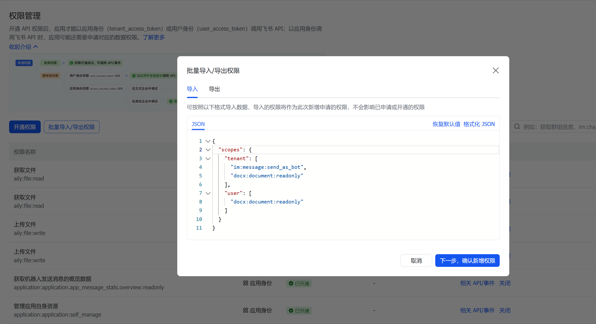
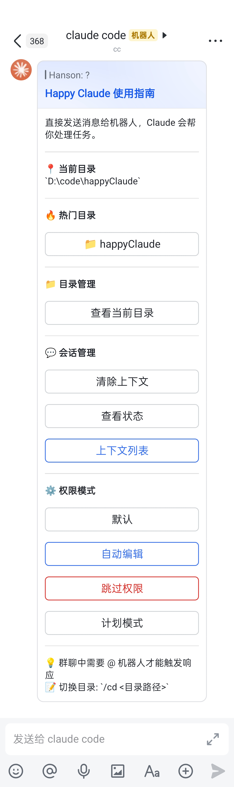

# 🤖 Claude Client

[中文文档](./README.md) | English

**Remote control your local Claude Code CLI through Feishu (Lark) messenger.**

Claude Client bridges the Feishu messaging platform with the Claude Code CLI, enabling you to interact with Claude AI remotely from your phone or any device with Feishu installed.

## 🌟 Highlights

### 📱 Code from Anywhere
Write code, refactor files, or debug issues from your phone while commuting, in meetings, or away from your desk. No VPN or remote desktop needed - just Feishu.

### 🔄 Know Your Task Status
Real-time progress updates every 30 seconds with PID monitoring. Always know if your long-running task is still processing or has completed, even on mobile.

### 🔥 Smart Directory Management
- **Hot Directories**: Quick access to your 5 most recent projects
- **Context per Directory**: Each project maintains its own conversation history
- **One-Click Resume**: Continue previous tasks without re-explaining context

### 🎯 Interactive Experience
Beautiful Feishu cards with clickable buttons - no need to memorize commands. Just tap to switch directories, change modes, or resume tasks.

### 📝 Configurable Change Logging
Automatically log all changes:
- **Git Mode**: Auto-commit with customizable message templates, includes diff
- **Feishu Docs**: Write changes directly to a Feishu document
- **Extensible**: Easy to add more logging backends

### 🛡️ Enterprise Ready
- Message deduplication prevents duplicate processing
- Per-chat working directory persistence
- Multiple permission modes for security control
- Session timeout for inactive conversations

## ✨ Features

- 📱 **Feishu Integration** - Interact with Claude through Feishu bot (private chat or group chat)
- 🔄 **Real-time Progress** - Live progress updates every 30 seconds with process status
- 📁 **Directory Management** - Switch between project directories, hot directories quick access
- 💬 **Session Persistence** - Resume previous conversations and maintain context
- 🔐 **Permission Modes** - Multiple permission modes for different security needs
- 📝 **Change Logging** - Configurable change logging (Git commits, Feishu docs, etc.)
- 🛠️ **Full Tool Support** - File operations, command execution, web search, and more
- 🎯 **Interactive Cards** - Beautiful Feishu cards with clickable buttons

## 📋 Prerequisites

- Node.js >= 18.0.0
- Claude Code CLI installed ([Installation Guide](https://docs.anthropic.com/en/docs/claude-code))
- Feishu Developer Account ([Feishu Open Platform](https://open.feishu.cn/))

## 🚀 Quick Start

### 1. Clone and Install

```bash
git clone https://github.com/YOUR_USERNAME/claude-client.git
cd claude-client
npm install
```

### 2. Configure Environment

```bash
cp .env.example .env
```

Edit `.env` file:

```env
# Feishu Bot Configuration
FEISHU_APP_ID=cli_xxxxxxxxxxxx
FEISHU_APP_SECRET=xxxxxxxxxxxxxxxxxxxx
FEISHU_DOMAIN=feishu  # or 'lark' for international version

# Server Configuration
PORT=3000
HOST=0.0.0.0

# Optional: Claude API Key (usually managed by CLI)
ANTHROPIC_API_KEY=sk-ant-xxxxxxxx
```

### 3. Install Claude Code CLI

```bash
# macOS/Linux
brew install claude

# Or via npm
npm install -g @anthropic-ai/claude-code

# Verify installation
claude --version
```

### 4. Configure Feishu Bot

#### 4.1 Create Feishu App

1. Go to [Feishu Open Platform](https://open.feishu.cn/) and login
2. Click "Create enterprise self-built app"
3. Fill in app name, description, and upload avatar

#### 4.2 Get App Credentials

From "Credentials & Basic Info" page:
- **App ID** → `FEISHU_APP_ID`
- **App Secret** → `FEISHU_APP_SECRET`

#### 4.3 Configure Event Subscription

1. Go to "Event Subscription" page
2. **Subscription Mode**: Select "Receive events via long connection"
3. Get the following credentials:
   - **Encrypt Key** → `FEISHU_ENCRYPT_KEY`
   - **Verification Token** → `FEISHU_VERIFICATION_TOKEN`
4. **Add Events**: Click "Add Event" and subscribe to:
   - `im.message.receive_v1` - Receive messages (required)
5. **Configure Card Callback**: In "Card Configuration", add:
   - `card.action.trigger` - Card button click callback (for help card interactions)

#### 4.4 Add App Permissions

Add the following permissions in "Permission Management" → "Request Permissions":

**Method 1: Batch Import (Recommended)**

1. Click the "Import Permissions" button in the top right corner
2. Paste the content of [imgs/feishu-permissions.json](./imgs/feishu-permissions.json) file
3. Click to confirm import



**Method 2: Manual Add**

In "App Capabilities" → "Bot":
1. Enable bot functionality
2. Search and add the following permissions:
   - `im:message` - Get and send messages in private and group chats
   - `im:message:send_as_bot` - Send messages as bot
   - `im:message.group_at_msg:readonly` - Get @bot messages in groups
   - `im:chat` - Get group info
   - `im:chat.members:bot_access` - Get group member list
   - `cardkit:card:write` - Send card messages (for help cards)

#### 4.5 Publish App

1. Create a version in "Version Management & Release"
2. Submit for review (internal apps can skip review)
3. After publishing, search the app name in Feishu to use

#### 4.6 Configure Environment Variables

Fill in the credentials in `.env` file:

```env
# Feishu Bot Configuration
FEISHU_APP_ID=cli_xxxxxxxxxxxx
FEISHU_APP_SECRET=xxxxxxxxxxxxxxxxxxxx
FEISHU_ENCRYPT_KEY=xxxxxxxxxxxxxxxxxxxx
FEISHU_VERIFICATION_TOKEN=xxxxxxxxxxxxxxxxxxxx
FEISHU_DOMAIN=feishu  # or 'lark' for international version
```

### 5. Build and Run

```bash
npm run build
npm start
```

Or run in development mode:

```bash
npm run dev
```

## 📖 Usage

### Interactive Card Preview

Send `?` to display the help card with hot directories and action buttons:



### Basic Interaction

Simply send a message to the bot in Feishu:

```
Read the package.json file and explain its structure
```

In group chats, mention the bot:

```
@Claude Help me refactor this function
```

### Commands

| Command | Description |
|---------|-------------|
| `?` or `？` or `/help` | Show help card with hot directories buttons |
| `/clear` or `/reset` | Clear current session context |
| `/status` | View session status |
| `/pwd` | Show current working directory |
| `/cd <path>` | Switch working directory (supports relative paths like `../`) |
| `/mode <mode>` | Change permission mode |
| `/tasklist` or `/tasks` | Show context history for current directory |
| `/resume <dir>` | Resume a previous task |
| `/taskdelete <dir>` | Delete task record for specified directory |

### Permission Modes

| Mode | Description |
|------|-------------|
| `default` | Manual approval required for all operations |
| `acceptEdits` | Auto-approve file edits, others need approval |
| `bypassPermissions` | Skip all permission checks (use with caution) |
| `plan` | Plan mode for complex task planning |

### Hot Directories

The help card shows your 5 most recently accessed directories for quick navigation:

```
? → Shows hot directories → Click to switch
```

### Task Management

- Each directory maintains its own conversation context
- Use `/tasklist` to see previous contexts for the current directory
- Resume previous tasks with one click

## ⚙️ Configuration

### Change Logging

Configure in `data/change-logger-config.json`:

```json
{
  "enabled": true,
  "type": "git",
  "git": {
    "autoCommit": false,
    "commitMessageTemplate": "feat(claude-client): {userMessage}",
    "includeDiff": true,
    "excludePatterns": ["node_modules", ".git", "dist"]
  }
}
```

Supported logging types:
- `git` - Log changes using Git
- `feishu-doc` - Log to Feishu document
- `console` - Print to console (for debugging)
- `none` - Disable logging

## 📁 Project Structure

```
claude-client/
├── src/
│   ├── feishu/              # Feishu integration
│   │   ├── client.ts        # API client
│   │   └── handler.ts       # Event handlers
│   ├── claude/              # Claude CLI integration
│   │   └── agent.ts         # Agent wrapper
│   ├── session/             # Session management
│   │   ├── manager.ts       # Session manager
│   │   ├── task-store.ts    # Task persistence
│   │   └── directory-store.ts # Directory history
│   ├── change-logger/       # Change logging system
│   │   ├── manager.ts       # Logger manager
│   │   ├── git-logger.ts    # Git logger
│   │   └── feishu-doc-logger.ts
│   ├── utils/               # Utilities
│   │   ├── config.ts        # Configuration
│   │   ├── logger.ts        # Logging
│   │   └── formatter.ts     # Message formatting
│   ├── types/               # TypeScript types
│   ├── app.ts               # Main application
│   └── cli.ts               # CLI entry point
├── data/                    # Persistent data
├── config/                  # Configuration files
└── dist/                    # Compiled JavaScript
```

## 🔒 Security Notes

1. **Network Security** - Don't expose the service directly to the public internet. Use VPN or tunneling services.
2. **File Access** - Claude can access files in the working directory and subdirectories.
3. **API Rate Limits** - Be aware of Claude API rate limits.
4. **Session Timeout** - Sessions expire after 30 minutes of inactivity.
5. **Permission Modes** - Use `bypassPermissions` mode with caution.

## 🛠️ Development

```bash
# Install dependencies
npm install

# Development mode with hot reload
npm run dev

# Build
npm run build

# Watch mode
npm run watch

# Run tests
npm test

# Lint
npm run lint
```

## 📚 References

- [Claude Code Documentation](https://docs.anthropic.com/en/docs/claude-code)
- [Claude Agent SDK](https://platform.claude.com/docs/agent-sdk/overview)
- [Feishu Open Platform](https://open.feishu.cn/)
- [Lark API Documentation](https://open.larksuite.com/document)

## 🤝 Contributing

Contributions are welcome! Please feel free to submit a Pull Request.

## 💬 Community

Join our group to discuss Claude Client usage and development:


## 📄 License

MIT License - see [LICENSE](LICENSE) for details.

---

Made with ❤️ by the Claude Client Team
